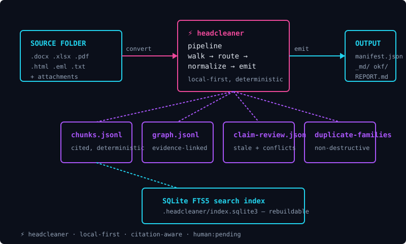

# headcleaner

> Walk a folder of mixed documents, get back clean Markdown you can search, cite, and trust.

headcleaner is a Python command-line tool that reads a folder of documents — Word, Excel, PowerPoint, PDF, HTML, plain text, email — and turns each one into a Markdown file with a citation back to its original source. The output is portable, searchable, and ready for indexing, archiving, or handing to an AI coding assistant. Headcleaner never silently rewrites your files, never claims the output has been human-reviewed when it has not, and never talks to a network service unless you explicitly tell it to.

## Why headcleaner exists

Most teams sit on folders full of `.docx`, `.xlsx`, `.pdf`, `.html`, and `.eml` files that are useful but hard to search, hard to cite, and hard to feed to modern AI tooling. Headcleaner is the missing layer between those folders and the systems that want to consume them: a local-first converter that produces a durable, citation-aware Markdown output you can rebuild, audit, and trust.

The core promise is small enough to fit on a sticky note: **read once, write Markdown with a source citation, and never lie about whether a human has reviewed it.**

## What headcleaner does

Headcleaner converts a folder of mixed documents into a clean output folder you control. The same input folder produces the same output bytes every time, and every output file carries the SHA-256 hash of the source it came from.

The conversion pipeline reads source files, normalizes them through format-specific adapters, and writes either plain Markdown, an OKF v0.2 knowledge bundle, or both side by side. On top of that, headcleaner can build a local SQLite search index, generate a knowledge graph of how your documents relate to each other, and surface cited chunks to compatible AI assistants through the Model Context Protocol.

## What headcleaner does not do

This list is short on purpose. Every item is a design choice, not an oversight.

- It does **not** silently rewrite your source files. Source files are read-only inputs to headcleaner; output goes to a directory you name.
- It does **not** claim that auto-converted output has been human-reviewed. Every emitted file starts in an explicit "human has not read this" state; changing that requires an explicit review action.
- It does **not** install tools you did not ask for. Optional converters like OfficeCLI, LibreOffice, and Tesseract are checked for at runtime; headcleaner tells you when one is missing instead of trying to install it.
- It does **not** talk to a network service by default. Embedding providers, remote vector databases, and MCP integration all require an explicit configuration step.
- It does **not** rewrite your git history, publish packages, or push to a remote. Version-control operations require explicit invocation.

## Three-step quick start

This is the smallest path from "I just installed headcleaner" to "I see something useful."

### Step 1 — Convert a folder

Pick any folder that contains documents headcleaner can read. For a first run, a folder with one PDF, one Word file, and one HTML file is ideal.

```bash
uv run --no-sync --python 3.13 headcleaner convert ./my-folder ./my-folder.clean
```

The `convert` command reads `./my-folder`, normalizes every supported document it finds, and writes the results to `./my-folder.clean`. By default you get both plain Markdown and an OKF v0.2 bundle side by side.

### Step 2 — Look at what was produced

Open `./my-folder.clean` in your file browser. You will see three things: a `manifest.json` that summarizes the run, an `_md/` folder containing one Markdown file per source, and an `okf/` folder containing the OKF v0.2 bundle with an `index.md` and one concept file per source.

```text
./my-folder.clean/
├── manifest.json          # run summary: what was processed, how, with what status
├── REPORT.md              # human-readable run report
├── _md/                   # plain Markdown, one file per source
│   ├── notes.docx.md
│   ├── report.pdf.md
│   └── page.html.md
└── okf/                   # OKF v0.2 bundle, one concept per source
    ├── index.md           # auto-generated directory index
    ├── notes.docx.md
    ├── report.pdf.md
    └── page.html.md
```

Each generated file starts with a YAML block that names the source it came from, the SHA-256 hash of that source, the date the source was generated, and the trust state. That block is how headcleaner keeps its promise that you can always answer "where did this text come from."

### Step 3 — Open the report and the manifest

`./my-folder.clean/REPORT.md` is a short Markdown file you can read in any editor. It tells you how many files were processed, which engine handled each one, and whether anything failed or was skipped. `./my-folder.clean/manifest.json` is the same information in a structured form that other tools can consume.

**What this means:** if your input folder had twelve documents and your run produced twelve Markdown files plus an OKF bundle plus a manifest, the conversion is healthy. If the report shows files in the `skipped` or `failed` state, jump to the [Troubleshooting guide](docs/user-guide/troubleshooting.md) — those states almost always mean an optional tool is missing, not that your project is broken.

## A simple visual

The flow is small enough to draw:



Source folder on the left, the headcleaner pipeline in the middle, output folder on the right. The four purple cards underneath are the rebuildable derivatives that fall out of the pipeline. The cyan card at the bottom is the local SQLite search index, built from the cited chunks.

## What to read next

Pick the path that matches what you came here to do.

- **I have never used headcleaner and want to install it.** Start with the [Installation guide](docs/getting-started/installation.md), then walk through the [First run guide](docs/getting-started/first-run.md). Both are written for someone who has never run a Python CLI tool before.
- **I want to understand what each command does.** Go to the [CLI reference](docs/reference/cli-reference.md), organized by what you are trying to accomplish.
- **I want to use headcleaner with an AI coding assistant.** Read [Working with AI assistants](docs/user-guide/working-with-ai-agents.md) and then [MCP client setup](docs/integrations/mcp-client-setup.md).
- **I want to add headcleaner to a CI pipeline.** Start with [CI integration](docs/integrations/ci-overview.md) and the [tutorial on CI integration](docs/tutorials/ci-integration.md).
- **I want to extend headcleaner with a new file format or tool.** Go to the [Contributor onboarding](docs/developer/contributor-onboarding.md) and then the [Tool and engine development guide](docs/developer/tool-and-engine-development.md).
- **I am developing or committing a change.** Follow the [development workflow](DEVELOPMENT.md) and the [documentation governance](docs/development/DOCUMENTATION_GOVERNANCE.md).
- **I want to understand the safety and trust model before I commit to using headcleaner.** Read the [Safety overview](docs/safety/safety-overview.md).

## Documentation map by reader goal

The complete documentation is organized by reader, not by source module. Each path below is a coherent walk that answers a specific question.

| If you want to… | Read |
|---|---|
| Install headcleaner on Windows, macOS, or Linux | [docs/getting-started/installation.md](docs/getting-started/installation.md) |
| Run your first conversion and understand the output | [docs/getting-started/first-run.md](docs/getting-started/first-run.md) |
| Understand the terms OKF, citation, FTS5, and trust | [docs/getting-started/glossary.md](docs/getting-started/glossary.md) |
| Build the everyday workflow that fits how I actually work | [docs/user-guide/everyday-workflow.md](docs/user-guide/everyday-workflow.md) |
| Read the output files and the report | [docs/user-guide/checking-converted-output.md](docs/user-guide/checking-converted-output.md) |
| Know whether the output is trustworthy | [docs/user-guide/citations-and-trust.md](docs/user-guide/citations-and-trust.md) |
| Set up local search and graph over the output | [docs/user-guide/search-and-context.md](docs/user-guide/search-and-context.md) |
| Use headcleaner with a coding assistant | [docs/user-guide/working-with-ai-agents.md](docs/user-guide/working-with-ai-agents.md) |
| Debug a skipped check, missing tool, or wrong exit code | [docs/user-guide/troubleshooting.md](docs/user-guide/troubleshooting.md) |
| Look up a specific command, flag, or behavior | [docs/reference/cli-reference.md](docs/reference/cli-reference.md) |
| Understand a specific engine, install hint, or skip behavior | [docs/reference/engine-directory.md](docs/reference/engine-directory.md) |
| Configure headcleaner with a project settings file | [docs/reference/configuration-reference.md](docs/reference/configuration-reference.md) |
| Add a new adapter, engine, or configuration field | [docs/developer/contributor-onboarding.md](docs/developer/contributor-onboarding.md) |
| Read the architecture and the canonical data model | [docs/developer/architecture.md](docs/developer/architecture.md) |
| Understand the trust and safety guarantees | [docs/safety/safety-overview.md](docs/safety/safety-overview.md) |
| Plan, implement, audit docs, and prepare a commit | [DEVELOPMENT.md](DEVELOPMENT.md) |

## License

Apache-2.0. See [LICENSE](LICENSE).