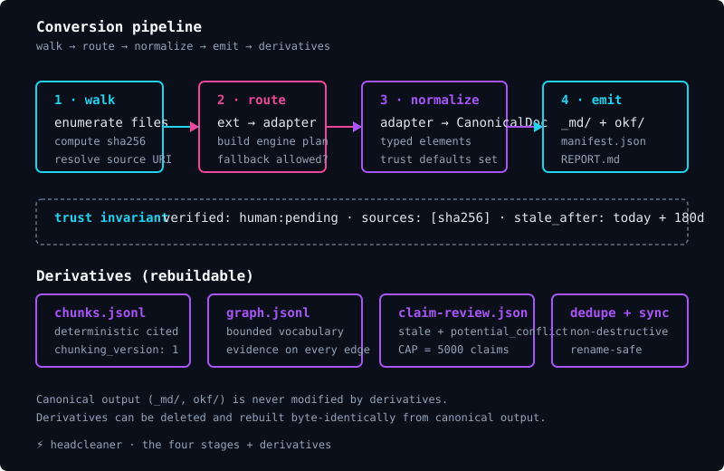
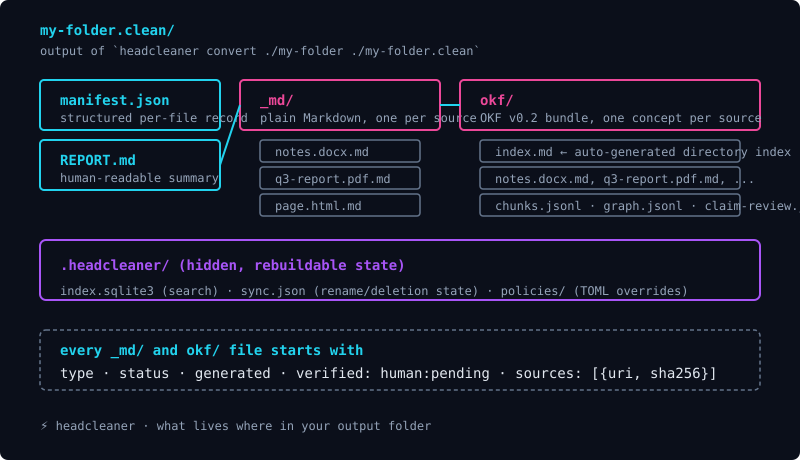

# Your first ten minutes with headcleaner

This page is the guided walk-through that turns a fresh install into a clean output folder you can read, search, and cite. It assumes nothing beyond the [installation guide](installation.md). By the end of this page you will have converted a small folder of mixed documents, read the output, and decided what to do next.

## What you are about to do

The goal of the first ten minutes is to confirm that headcleaner works on your machine with the documents you care about. You will pick a small folder — three to ten mixed documents is plenty — convert it, open the output, and learn how to read what headcleaner produced. You will not configure anything, you will not install any optional tools, and you will not need to learn any internal terminology beyond what is explained here.

## Pick a folder to convert

Find a folder on your computer that contains documents headcleaner can read. The supported formats out of the box are:

- Microsoft Word documents (`.docx`, and `.doc` if LibreOffice is installed)
- Microsoft Excel spreadsheets (`.xlsx`, and `.xls` if LibreOffice is installed)
- Microsoft PowerPoint presentations (`.pptx`, and `.ppt` if LibreOffice is installed)
- PDF documents (`.pdf`)
- HTML files (`.html`, `.htm`)
- Plain text files (`.txt`)

If you do not have a folder that fits, create one. Drop in a Word document, a PDF, and an HTML file you saved from a website. That is enough to see every built-in adapter at work.

For the rest of this page, replace `./my-folder` with the actual path to your folder.

## Run the conversion

Open a terminal in the folder where you want the output to land and run:

```bash
uv run --no-sync --python 3.13 headcleaner convert ./my-folder ./my-folder.clean
```

The command reads every supported document in `./my-folder` and writes the converted output to `./my-folder.clean`. While it runs, headcleaner walks the folder, picks an engine per file, normalizes the output, and writes the canonical Markdown plus OKF bundle plus rebuildable derivatives.



If you would rather see only the final summary and not the per-per-file progress lines, add `--quiet`. If you would rather see everything in JSON form for piping into another tool, add `--json`. Both flags are documented in the [CLI reference](../reference/cli-reference.md).

## Look at what was produced

Open `./my-folder.clean` in your file browser. The first thing you will notice is that there are three things in the folder, not just one:



The cyan cards on the left are the run-level artifacts. The pink `_md/` and `okf/` cards are the per-source outputs. The purple `.headcleaner/` card at the bottom is the hidden rebuildable state directory.

The `_md/` folder is plain Markdown. Each file is the source document rendered as Markdown with a YAML block at the top recording the source path, the source SHA-256 hash, the generation date, and the trust state. If you want clean Markdown to read or to paste into a wiki, this is where you look.

The `okf/` folder is the same content as an OKF v0.2 knowledge bundle. OKF bundles are designed to be portable between knowledge-management tools, so if you intend to feed the output into a downstream system that understands OKF, this is what you want. The `index.md` at the top of the bundle is auto-generated by headcleaner and lists every concept in the folder.

The `manifest.json` file at the top is the canonical summary of the run. It is the source of truth that every other tool reads from. If something looks wrong in `_md/` or `okf/`, the manifest is where you check whether the conversion actually succeeded.

The `REPORT.md` file is the same information in human-readable Markdown form. Open this first when you want to know "did everything work."

## Open one of the converted files

Open `./my-folder.clean/_md/notes.docx.md` in any text editor. You will see something that starts like this:

```markdown
---
type: Document
status: unverified
generated: human:you@example
verified: human:pending
stale_after: 2027-02-16
sources:
- uri: file:///path/to/your/notes.docx
  sha256: aaaaaaaaaaaaaaaaaaaaaaaaaaaaaaaaaaaaaaaaaaaaaaaaaaaaaaaaaaaaaaaa
---

# Heading from your Word file

The first paragraph from your document, converted to Markdown.

- A bulleted list, preserved from the original.

| Column A | Column B |
|---|---|
| value 1 | value 2 |
```

The block between the two `---` lines is called **frontmatter**. Headcleaner writes it on every converted file so you can always answer three questions about any piece of output:

- Where did this come from? Look at `sources[0].uri` and `sources[0].sha256`.
- Was a human involved in checking it? Look at `verified`. Headcleaner sets this to `human:pending` on every auto-converted file. Changing it requires an explicit human action.
- Is the content still considered fresh? Look at `stale_after`. Headcleaner sets this to 180 days after the conversion date by default. After that date, downstream tools should treat the file as needing a re-review.

The text after the frontmatter is your document rendered as Markdown. Headcleaner converts headings, paragraphs, lists, and tables to their Markdown equivalents. Inline formatting like bold and italic is preserved. Images are referenced by their original path so you can keep them alongside the converted file.

## Open the run report

Open `./my-folder.clean/REPORT.md`. It looks like this:

```markdown
# headcleaner conversion report

- **Bundle:** `/path/to/your/my-folder`
- **Started:** 2026-08-20T14:32:01
- **Finished:** 2026-08-20T14:32:04
- **Wall clock:** 3.2s

## Summary

| Metric | Value |
|---|---|
| Files processed | **3** |
| Files skipped | 0 |
| Files failed | 0 |
| **Total** | 3 |
| Success rate | 100.0% |

## Per-engine breakdown
…
```

The summary table tells you what happened at a glance. Three values matter on a healthy run:

- **Files processed** is the count of source files that headcleaner successfully converted.
- **Files skipped** is the count of files headcleaner saw but did not convert, usually because they were not in a supported format or because an optional tool for that format was not installed. `skipped` does not mean broken; it means headcleaner had nothing to do with that file or no tool available.
- **Files failed** is the count of source files that headcleaner tried to convert but could not. A non-zero count here is the only state that needs investigation. See the [troubleshooting guide](../user-guide/troubleshooting.md) for the symptom-driven fix path.

## Read the manifest

`./my-folder.clean/manifest.json` is the structured version of the report. It is what every other tool reads when they want to know what headcleaner produced. The relevant fields for a first run are:

- `started_at` and `finished_at`: the wall-clock timestamps for the run.
- `results`: an array with one entry per source file. Each entry has `relpath` (the file path relative to the input folder), `engine` (which adapter handled it, e.g. `officecli` for a Word file), `status` (`ok`, `skipped`, or `failed`), `sha256` (the source file hash), and `error` (a human-readable explanation if status is `failed`).
- `options`: the run settings you passed on the command line, recorded for reproducibility.

If a file is in `failed` status, the matching `error` field will tell you why. The most common cause on a first run is a missing optional tool; see the [installation guide](installation.md#optional-tools-that-make-headcleaner-more-useful) for the list.

## Where to go next

You have a converted folder you can read. From here the documentation branches based on what you want to do next.

- If you want headcleaner to remember what it did so the next conversion is faster, see the [everyday workflow guide](../user-guide/everyday-workflow.md). It explains caching, re-runs, and the `--no-cache` flag.
- If you want to search your converted output without leaving the terminal, see the [local search tutorial](../tutorials/local-search.md).
- If you want to feed your converted output to an AI coding assistant, see [working with AI assistants](../user-guide/working-with-ai-agents.md).
- If something did not look right on the first run, see the [troubleshooting guide](../user-guide/troubleshooting.md).
- If you want to understand the citation and trust model in depth, see [citations and trust](../user-guide/citations-and-trust.md).