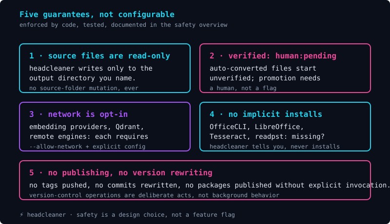

# Safety overview

Headcleaner is built around a small set of safety guarantees. They are not aspirational; they are properties of the implementation that you can verify by reading the code and the run output. This page is the single-page summary of those guarantees. Each one is documented in more detail in the linked pages.

## The five guarantees

The guarantees are:

1. **Auto-conversion never claims human review.** Every auto-converted file starts with `verified: human:pending` in its frontmatter. The only way to change that field is a manual edit by a human; headcleaner will never silently promote a file.
2. **Headcleaner never modifies your source files.** The conversion reads from the directory you specify as input and writes to the directory you specify as output. Source files are not touched by any command.
3. **Headcleaner never talks to a network service without explicit configuration.** Every network-capable feature — embedding providers, remote vector databases, MCP client connections — requires an explicit flag (`--allow-network`) and explicit destination configuration.
4. **Headcleaner never implicitly installs tools.** Optional converters (OfficeCLI, LibreOffice, Tesseract, `readpst`) are checked for at runtime. If one is missing, headcleaner tells you with a clear message; it does not try to install it for you.
5. **Headcleaner never rewrites your git history, publishes packages, or pushes to a remote.** Version-control operations require explicit invocation through commands you ran yourself.

The guarantees are enforced by the implementation. They are tested. They are not configurable; you cannot disable them through a policy file or a flag.

## Why these guarantees matter

Each guarantee exists because the absence of it would create a specific failure mode:

- **Without the `verified` invariant**, downstream systems that consume headcleaner output could treat auto-converted content as if a human had reviewed it. That would be unsafe for any archive that requires human review (regulatory, legal-hold, publication pipelines).
- **Without the source-immutability invariant**, headcleaner could silently corrupt your original documents. The blast radius of a bug would be your source folder rather than the output folder you control.
- **Without the network-permission invariant**, headcleaner could send your documents to a third party without your knowledge. The blast radius would be a privacy incident.
- **Without the explicit-install invariant**, headcleaner could install software on your machine that you did not ask for. The blast radius would be an unauthorized environment change.
- **Without the no-publishing invariant**, headcleaner could rewrite your tags, push to your remotes, or publish packages under your identity. The blast radius would be an unauthorized release.

The guarantees are not configurable because turning any of them off would defeat the purpose of using headcleaner in the first place.

## What the guarantees do not promise

The guarantees are specific. They do not promise:

- That headcleaner's output is correct. The output is faithful to the source bytes, but the source may be wrong, ambiguous, or misleading. A human reviewer is responsible for evaluating the content.
- That headcleaner is bug-free. Headcleaner is software; it may have bugs. Open an issue when you find one.
- That headcleaner is suitable for every use case. Headcleaner is a CLI tool designed for local document conversion. It is not a regulatory archiving system, not a publication pipeline, and not a legal-hold tool. Build those systems on top of headcleaner's output, with their own audit trails and review processes.

## Where to read next

The [permissions page](permissions.md) documents every flag that affects the guarantees. The [privacy and data handling page](privacy-and-data-handling.md) explains what headcleaner does with the data you give it. The [security model page](security-model.md) documents the threat model and the mitigations.

## How to report a safety issue

If you find a bug that violates one of the guarantees — for example, a code path that writes to the source folder, or a network call that fires without `--allow-network` — please open an issue. The maintainers treat safety violations as the highest priority class of bug.